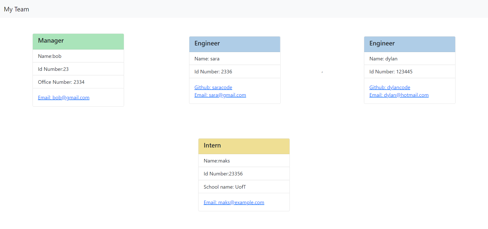

# Team Profile Generator
  
 
 ## Description
 
 This project allows for employers to create teams with Managers, Engineers, and Interns. This is displayed in a HTML page using the information that was provided in the prompt questions.

 The link to the video is [here](https://watch.screencastify.com/v/aABySFtQSLZdC5K5LKan)

  This is the screenshot of the result of the video's HTML file that was created:
 [screenshot.png](dist/assets/images/screenshot.png)

 ## Table of Contents
 * [Installation](#Installation)
 * [Usage](#Usage)
 * [Contributing](#Contributing)
 * [Tests](#Tests)
 * [Questions](#Questions)
 
 ## Installation
 You must have node and npm inquirer

 ## Usage
 using the node index.js commmand in the terminal in the file the project is located, will start the project prompts to begin. 
 
 ## Contributing
 N/A

 ## Tests
 Yes each employee role has been tested and has been passed

 ## Questions
 here is the link to my Github: [github.com/maks-pixel](github.com/maks-pixel)
 If you have any questions regarding the project or anything else you can contact me at:
 
  Email: [maksgirmay@gmail.com](maksgirmay@gmail.com) 
